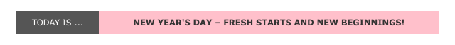

# 🌟 Daily Fun Message Badge

[](https://github.com/in-c0/daily-badge/actions/workflows/tests.yml)
[](https://github.com/in-c0/daily-badge/actions/workflows/daily-badge.yml)

Get a cute, quirky, uplifting message on your GitHub profile — refreshed daily ✨



A new message every day, in **your** timezone. Live example:


## 💖 Add it to your GitHub profile

Add this to the `README.md` of your profile repo (a repo named exactly after your username):

```markdown

```

> **Two URLs, both work.** The `badge.json` is available via GitHub Pages
> (`https://in-c0.github.io/daily-badge/badge.json`, used above) *and* directly from raw
> (`https://raw.githubusercontent.com/in-c0/daily-badge/main/badge.json`). Either is a valid
> Shields.io `endpoint`. Shields caches the rendered badge for a few minutes, so a fresh
> daily message can take a moment to appear — a hard refresh clears it.

### 🕒 Customize the timezone

Change when your message flips by editing `timezone.txt` with any [IANA timezone](https://en.wikipedia.org/wiki/List_of_tz_database_time_zones), e.g. `Australia/Sydney`.

---

## 🚀 Zero-setup hosted version (no fork)

There's also a [Cloudflare Worker](worker/) that serves the badge from a single URL — **no fork, no Actions, no per-user setup.** Just paste one line and pick your options:

```markdown

```

| Param | Options | Default |
|-------|---------|---------|
| `tz` | any IANA timezone | `UTC` |
| `pack` | `default` · `dev-humor` · `tech-facts` | `default` |
| `color` | any CSS / Shields color | `pink` |
| `style` | `flat` · `flat-square` · `plastic` · `for-the-badge` · `social` | `for-the-badge` |

> ⏳ The hosted endpoint goes live once the Worker is deployed — see [`worker/README.md`](worker/README.md) to run it yourself in ~2 minutes.

**Message packs** let the badge feel like *yours*:
- **default** — a curated "on this day" message for all 366 days
- **dev-humor** — a rotating dose of developer comedy 🐛
- **tech-facts** — a daily piece of computing trivia 💡

---

## 🔄 How it works

1. GitHub Actions runs once daily at midnight UTC (or, for the hosted version, the Worker computes the day on request in your timezone)
2. It picks the message for the current date
3. The badge is rendered by Shields.io / the Worker and served from the edge

Powered by Shields.io, GitHub Actions, and Cloudflare Workers.
Made with ❤️ by [in-c0](https://github.com/in-c0)
